# 第一章 简介

## 1.1 概要

Spring Security 基于 Spring 框架，提供了一套 Web 应用安全性的完整解决方案

Web 应用的安全性包括 **用户认证(Authentication)**  和 **用户授权(Authorization)** 两个部分，这两个部分也是 Spring Security 的重要核心功能

- 用户认证( Authentication )

  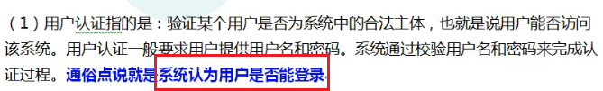

- 用户授权( Authorization )

  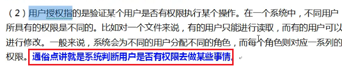

## 1.2 同款产品对比

SpringSecurity 特点

1. 和 Spring 无缝整合
2. 全面的权限控制
3. 专门为 Web 开发而设计
   - 旧版本不能脱离 Web 环境使用
   - 新版本中对整个框架进行了**分层抽取**，分成了核心模块和 Web 模块，单独引入核心模块就可以脱离 Web 环境
4. 重量级(缺点)

Shiro 的特点

1. 轻量级。针对性能有更高要求的互联网应用有更好表现
2. 通用性
   - 好处：不局限于 Web 环境，可以脱离 Web 环境使用
   - 坏处：在 Web 环境下一些特定的需求需要手动编写代码定制

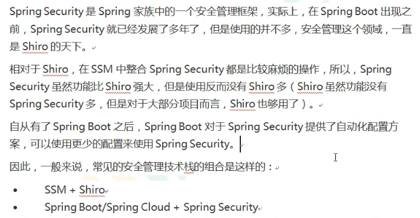

## 1.3 Hello World

1. 创建对应的 SpringBoot 工程

2. 导入对应的依赖

   ```xml
   <dependency>
       <groupId>org.springframework.boot</groupId>
       <artifactId>spring-boot-starter-security</artifactId>
   </dependency>
   ```

3. 编写 Controller，启动服务器并访问

   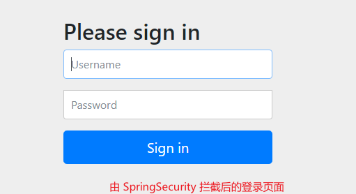

4. Spring Security 提供默认的用户名(user)和密码(查看控制台打印)

   

5. 登录后查看响应

## 1.4 Spring Security 基本原理

> Spring Security 本质就是一个 **过滤器链**

### 1) 过滤器链

**FilterSecurityInterceptor**：方法级别的权限过滤器，基本位于过滤链的最底层

```dart
// FilterInvocation 实例 - 一个包装类而已
doiFilter() -> invoke(new FilterInvocation(request, response, chain));
```

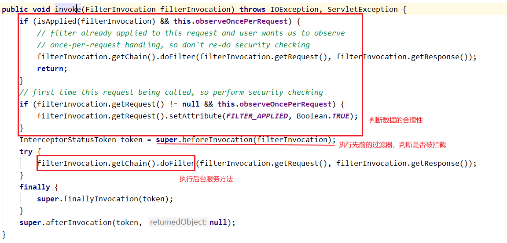

**ExceptionTranslationFilter**：异常过滤器，用来处理认证授权过程中出现的异常	

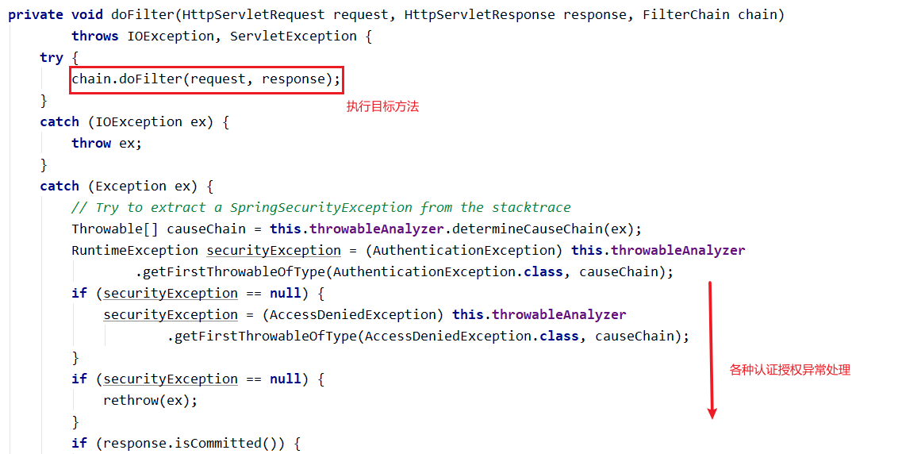

**UsernamePasswordAuthenticationFilter**: 对 /login 的 POST 请求做拦截，校验表单中的用户名和密码

```java
private void doFilter(HttpServletRequest request, HttpServletResponse response, FilterChain chain)
    throws IOException, ServletException {
    if (!requiresAuthentication(request, response)) {
        chain.doFilter(request, response);
        return;
    }
    try {
        // 获取用户登录信息
        Authentication authenticationResult = attemptAuthentication(request, response);
        if (authenticationResult == null) {
            // return immediately as subclass has indicated that it hasn't completed
            return;
        }
        this.sessionStrategy.onAuthentication(authenticationResult, request, response);
        // Authentication success
        if (this.continueChainBeforeSuccessfulAuthentication) {
            chain.doFilter(request, response);
        }
        // 认证成功的方法
        successfulAuthentication(request, response, chain, authenticationResult);
    }
    catch (InternalAuthenticationServiceException failed) {
        // 认证失败的方法
        this.logger.error("An internal error occurred while trying to authenticate the user.", failed);
        unsuccessfulAuthentication(request, response, failed);
    }
    catch (AuthenticationException ex) {
        // Authentication failed
        unsuccessfulAuthentication(request, response, ex);
    }
}
```

### 2) 过滤器加载过程 

1. 使用 **DelegatingFilterProxy.doFilter()** 配置过滤器

   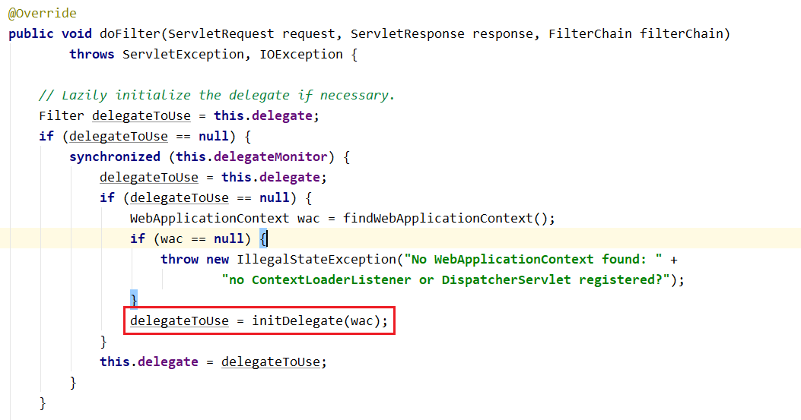

2.  获取保存在 Web 子容器中的 **FilterChainProxy(过滤器链代理对象)** 组件

   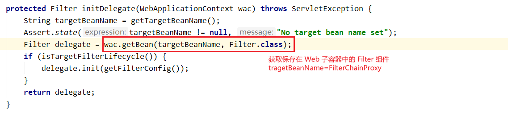

3. `FilterChainProxy.doFilter()` -> `doFilterInternal()` 获取过滤器链并执行其中的过滤器

   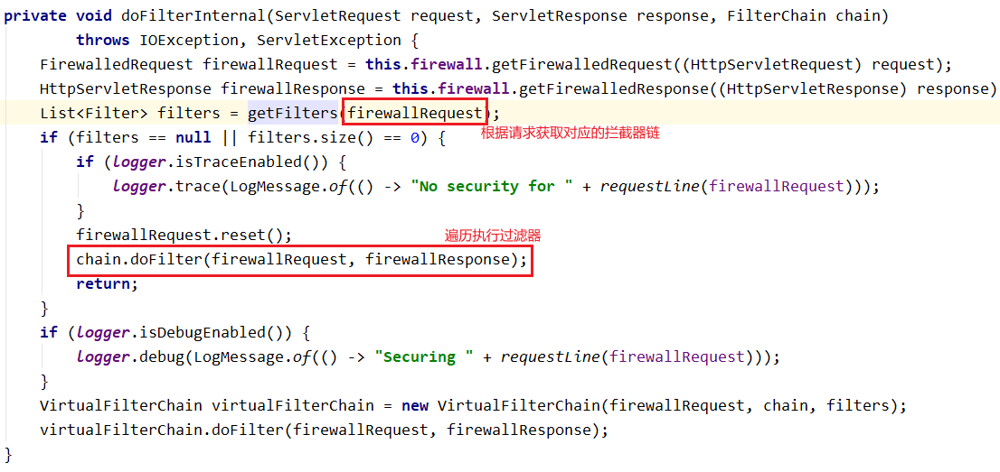
   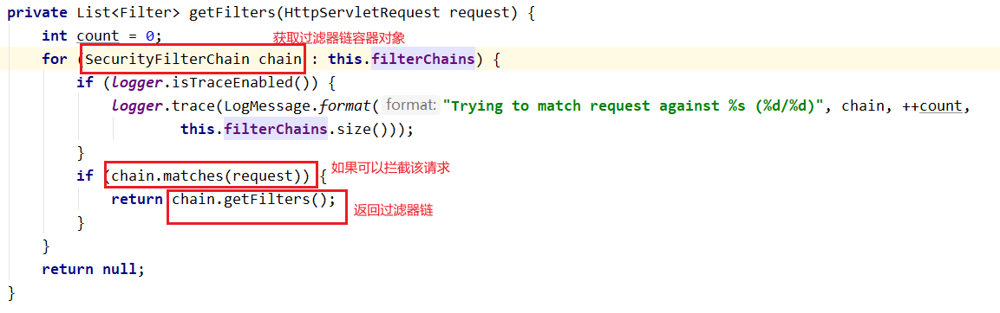

### 3) 两个重要接口

#### 一、UserDetailsService

作用：查询数据库中用户的信息

实现步骤：

1. 创建一个类继承 **UsernamePasswordAuthenticationFilter** 类，重写三个方法(

   `attemptAuthentication(HttpServletRequest request, HttpServletResponse response)` 进行用户名和密码的判断、

   `successfulAuthentication(HttpServletRequest request, HttpServletResponse response, FilterChain chain,Authentication authResult)` - 认证成功、

   `unsuccessfulAuthentication(HttpServletRequest request, HttpServletResponse response,AuthenticationException failed)`  - 认证失败

   )

2. 创建一个类实现 **UserDetailsService** 接口，重写 `loadUserByUsername` 查询数据库用户数据后，返回 User 对象(该对象是 Spring Security 的那个)

#### 二、PasswordEncoder

作用：数据加密接口，用于返回 User 对象中的密码加密

# 第二章 Web 权限控制方案

## 2.1 (认证)设置登录的用户名和密码

### 1) 通过配置文件

```properties
# 配置用户名和密码
spring.security.user.name=Geek
spring.security.user.password=123456
```

### 2) 通过配置类

```java
/**
* 重写 configure(AuthenticationManagerBuilder auth) 创建一个用户
* @param auth
* @throws Exception
*/
@Override
protected void configure(AuthenticationManagerBuilder auth) throws Exception {
    // 通过 BCryptPasswordEncoder 密码加密接口对密码进行加密
    String encode = new BCryptPasswordEncoder().encode("123456");
    // inMemoryAuthentication()：将用户身份信息保存到内存中
    auth.inMemoryAuthentication().withUser("geek").password(encode).roles("admin");
}

/**
* 将数据加密方式对应的实现类作为 Bean 注册到 IOC 容器中
* @return
*/
@Bean
public PasswordEncoder passwordEncoder(){
    return new BCryptPasswordEncoder();
}
```

### 3) 自定义编写实现类

设计一个 Security 配置类，配置使用的 UserDetailsService 组件

```java
@Configuration
public class SecurityConfig extends WebSecurityConfigurerAdapter {

    @Autowired
    private UserDetailsService userDetailsService;

    /**
     * 重写 configure(AuthenticationManagerBuilder auth) 创建一个用户
     * @param auth
     * @throws Exception
     */
    @Override
    protected void configure(AuthenticationManagerBuilder auth) throws Exception {
        auth.userDetailsService(userDetailsService);
    }

}
```

设计一个实现 **UserDetailsService** 接口的实现类，返回用户信息

```java
@Service("userDetailsService")
public class MyUserDetailsService implements UserDetailsService {

    @Autowired
    @Qualifier("passwordEncoder")
    private PasswordEncoder passwordEncoder;

    @Override
    public UserDetails loadUserByUsername(String s) throws UsernameNotFoundException {
        List<GrantedAuthority> grantedAuthorities = AuthorityUtils.commaSeparatedStringToAuthorityList("master");
        return new User("geek", passwordEncoder.encode("123456"), grantedAuthorities);
    }

}
```

## 2.2 自定义登录界面 & 自定义配置请求是否需要认证

1. 进行相关的配置

   ```java
   /**
   * 配置登录页面的请求拦截
   * @param http
   * @throws Exception
   */
   @Override
   protected void configure(HttpSecurity http) throws Exception {
       http.formLogin() // 自定义配置登录表单
           .loginPage("/login.html") // 配置登录页面
           .loginProcessingUrl("/login") // 配置登录页面访问路径，底层由 Spring Security 实现
           .defaultSuccessUrl("/test/index") // 配置登录成功后跳转页面
           .permitAll() // 放行
           .and().authorizeRequests() // 自定义配置拦截请求
           .antMatchers("/", "/login", "/test/hello").permitAll() // 对匹配成功的路径放行(‘permitAll()’)
           .anyRequest().authenticated() // 剩下的任何请求路径都需要认证
           .and().csrf().disable(); // 关闭 csrf 的防护
   }
   ```

2. 添加对应的请求控制器和页面

   ```html
   <!-- action 表单提交的地址必须是刚刚配置的 loginProcessingUrl 的值且提交方式为 POST -->
   <form action="/login" method="post">
       <!-- name 值必须分别为 username & password -->
       <input type="text" name="username"/><br/>
       <input type="text" name="password"/><br/>
       <input type="submit" value="提交"/><br/>
   </form>
   ```

   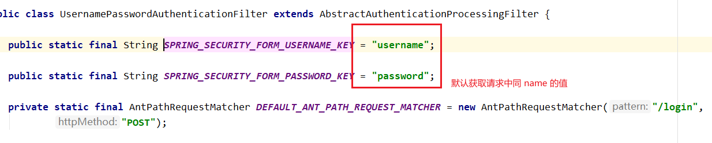

3. 测试时如果发现配置的登录界面无法访问时(404), 在 `application.properties` 中添加如下配置

   ```properties
   spring.web.resources.static-locations=classpath:/templates/
   ```

4. 测试

## 2.3  基于角色和权限进行访问控制

> hasAuthority("权限名")：只有具有对应的权限的主体才可以进行相应的操作

1. 添加配置

   ```java
   http.antMatchers("/test/index").hasAuthority("admin") // 在访问对应的资源必须有对应的权限(hasAuthority)
   ```

2. 修改用户权限

   ```java
   @Override
   public UserDetails loadUserByUsername(String s) throws UsernameNotFoundException {
       // 配置对应的权限列表
       List<GrantedAuthority> grantedAuthorities = AuthorityUtils.commaSeparatedStringToAuthorityList("admin");
       return new User("geek", passwordEncoder.encode("123456"), grantedAuthorities);
   }
   ```

3. 测试

   具有相关权限 -> 访问相关

   不具有相关权限 -> 访问失败，放回 403(没有操作权限)

   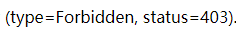

> hasAnyAuthority("权限名1"[,"权限名2"...])：只有具有其中任一权限就可以进行相关操作

1. 添加配置

   ```java
   .antMatchers("/test/index").hasAnyAuthority("admin", "master") // 在访问对应的资源时只要有其中一个权限(hasAnyAuthority)
   ```

2. 修改用户权限

   ```java
   @Override
   public UserDetails loadUserByUsername(String s) throws UsernameNotFoundException {
       // 配置对应的权限列表
       List<GrantedAuthority> grantedAuthorities = AuthorityUtils.commaSeparatedStringToAuthorityList("master");
       return new User("geek", passwordEncoder.encode("123456"), grantedAuthorities);
   }
   ```

3. 测试

> hasRole("角色名")：只有具有对应的角色的主体才可以进行相应的操作

1. 添加配置

   ```java
   .hasRole("master") // 访问对应的资源时必须具有对应的角色(hasRole)
   ```

2. 配置用户角色

   ```java
   @Override
   public UserDetails loadUserByUsername(String s) throws UsernameNotFoundException {
       /*
       * 配置对应的权限、角色列表
       *   - 配置用户角色时需要在前面加上 'ROLE_'
       * */
       List<GrantedAuthority> grantedAuthorities = AuthorityUtils.commaSeparatedStringToAuthorityList("ROLE_master");
       return new User("geek", passwordEncoder.encode("123456"), grantedAuthorities);
   }
   ```

   **(底层)添加 ROLE_**

   配置权限

   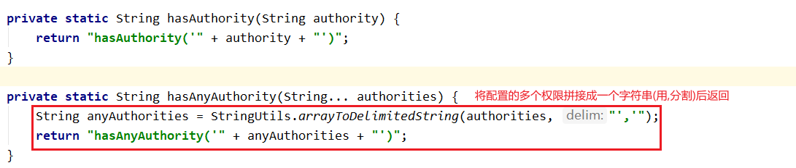

   配置角色

   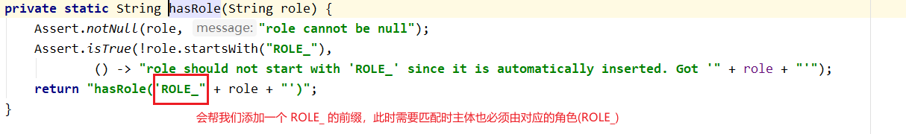

3. 测试

> hasAnyRole("角色1"[,"角色2"...])：只要具有其中任一角色即可进行相关操作、

1. 添加配置

   ```java
   .hasAnyRole("master", "admin") // 访问对应的资源时只要有其中一个角色即可(hasAnyRole)
   ```

2. 修改用户角色

   ```java
   @Override
   public UserDetails loadUserByUsername(String s) throws UsernameNotFoundException {
       /*
       * 配置对应的权限、角色列表
       *   - 配置用户角色时需要在前面加上 'ROLE_'
       * */
       List<GrantedAuthority> grantedAuthorities = AuthorityUtils.commaSeparatedStringToAuthorityList("ROLE_admin");
       return new User("geek", passwordEncoder.encode("123456"), grantedAuthorities);
   }
   ```

3. 测试

## 2.4 自定义 403 页面

1. 添加配置

   ```java
   @Override
   protected void configure(HttpSecurity http) throws Exception {
       http
           ....
           .exceptionHandling().accessDeniedPage("/unauth.html"); // 配置没有权限时访问的页面
   }
   ```

2. 创建对应的页面

3. 测试

## 2.5 注解使用

### 1) @Secured

> 只有具有任一角色才可以访问对应的方法

1. 在配置类上添加注解 `@EnableGlobalMethodSecurity(securedEnabled = true)`

2. 在对应的控制方法上添加 `@Secured` 注解并指定角色

   ```java
   /*
   * @Secured: 只有主体具有对应 value 中的任一角色才可以访问该请求
   *   - value: String[] 可以配置多个角色，但需要以 ROLE_ 开头
   * */
   @Secured({"ROLE_master", "ROLE_admin"})
   @GetMapping("/secured")
   public String getSecured(){
       return "has role master or admin";
   }
   ```

3. 测试

### 2) @PreAuthorize

> 在调用方法之前判断主体是否具有相应的权限/角色
>
> 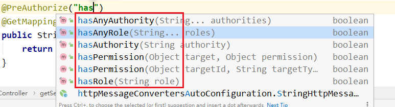

1. 在配置类添加注解 `@EnableGlobalMethodSecurity(prePostEnabled = true) `

2. 在对应的控制器方法上使用

   ```java
   @PreAuthorize("hasAuthority('master')")
   @GetMapping("/secured")
   public String getSecured(){
       return "has role master or admin";
   }
   ```

3. 测试

### 3) @PostAuthorize

> 在对应的控制器方法之后再判断用户是否具有相应的权限/角色

1. 在配置类添加注解 `@EnableGlobalMethodSecurity(prePostEnabled = true) `

2. 在对应的控制器方法上使用

   ```java
   @PostAuthorize("hasAnyAuthority('master')")
   @GetMapping("/secured")
   public String getSecured(){
       System.out.println("update....");
       return "has role master or admin";
   }
   ```

3. 测试，可以发现，无论是否具有该权限，对应请求的控制器方法都会执行

   

### 4) @PreFilter & @PostFilter

> @PreFilter：对方法传入的数据进行过滤
>
> @PostFilter：对方法返回的数据进行过滤

1. 在对应的控制器方法上使用并定义过滤

   ```java
   /* @PreFilter & @PostFilter: 对方法传入的数据进行过滤 & 对方法返回的数据进行过滤
   *   filterTarget: String(@PreFilter 使用) - 当接收多个集合时，可以指定对哪一个集合进行过滤
   *   value: String
   *       - filterObject: 内置对象表示返回(输入)的集合内的对象
   * */
   @GetMapping("/getAll")
   @PostFilter("filterObject.username.equals('巴御前')")
   public List<User> getAll(){
       return new ArrayList<>(
           Arrays.asList(
               new User(11,"阿巴巴", "1123456"),
               new User(17,"巴御前", "20210321")
           )
       );
   }
   ```

2. 测试

   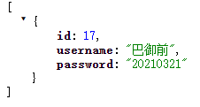

## 2.6 用户注销

1. 修改配置类

   ```java
   http.logout() // 配置注销设置
       .logoutUrl("/logout") // 设置注销请求地址，默认是 /logout
       .logoutSuccessUrl("/login.html").permitAll(); // 设置注销后的跳转页面
   ```

2. 创建对应的页面

   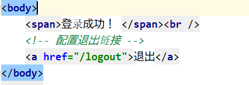

3. 测试

## 2.7 基于数据库实现记住我

### 1) 实现原理

1. 当用户进行第一次访问时，Spring Security 会生成一个 Token 保存在 Cookie 中并返回给游览器

2. 同时将该 **Token** 和对应的**用户信息字符串**保存到数据库中

3. 用户进行第二次访问时，判断其是否携带了和数据库中相同的 Token，如果有就将取出用户信息实现自动登录

   如果没有就进行认证

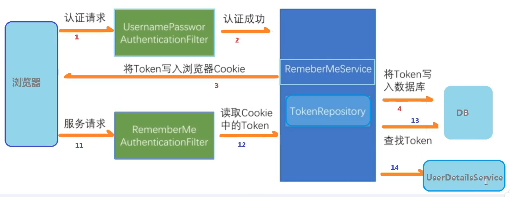

UsernamePasswordAuthenticationFilter.successfulAuthentication() -> this.rememberMeServices.loginSuccess() -> 

创建对应的令牌保存到数据库和 Cookie 中

```java
// 生成 Token
PersistentRememberMeToken persistentToken = new PersistentRememberMeToken(username, generateSeriesData(),
      generateTokenData(), new Date());
try {
   // 保存在数据库中
   this.tokenRepository.createNewToken(persistentToken);
   // 保存到 Cookie 中
   addCookie(persistentToken, request, response);
}
```

保存到数据库中，调用的是 **JdbcTokenRepositoryImpl** 实现类中的方法

```java
@Override
public void createNewToken(PersistentRememberMeToken token) {
   getJdbcTemplate().update(this.insertTokenSql,token.getUsername(),token.getSeries(),token.getTokenValue(), token.getDate());
}
```

### 2) 功能实现

1. [可选可不选] 根据 **JdbcTokenRepositoryImpl** 的 SQL 语句创建对应的数据库

   ```sql
   create table persistent_logins (
       username varchar(64) not null, 
       series varchar(64) primary key, 
       token varchar(64) not null, 
       last_used timestamp not null
   )
   ```

2. 配置数据源和对应的数据库操作组件(JdbcTokenRepositoryImpl)

   ```java
   /**
   * 配置登录页面的请求拦截
   * @param http
   * @throws Exception
   */
   @Override
   protected void configure(HttpSecurity http) throws Exception {
       http
           ...
           .and().rememberMe() // 配置记住我功能
           .tokenRepository(persistentTokenRepository()) // 配置使用的数据库操作对象
           .tokenValiditySeconds(60); // 配置数据库数据过时时长，单位为妙
   }
   /**
   * 创建实现记住我的数据库操作对象
   * @return
   */
   @Bean
   public PersistentTokenRepository persistentTokenRepository(){
       JdbcTokenRepositoryImpl jdbcTokenRepository = new JdbcTokenRepositoryImpl();
       jdbcTokenRepository.setDataSource(dataSource); // 配置数据源
       jdbcTokenRepository.setCreateTableOnStartup(true); // 在启动时自动建表,如果已经存在可以不配置
       return jdbcTokenRepository;
   }
   ```

3. 修改 login.html

   ```html
   <!-- 添加一个 checkbox 用于实现自动登录功能，name 值必须为 remember-me -->
   <input type="checkbox" name="remember-me"/><br/>
   ```

4. 测试

   

   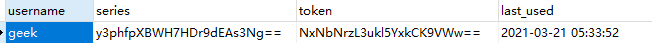

   

## 2.8 CSRF

### 1) 说明

**跨站请求伪造**

通过缩写为 CSRF / XSRF, 是一种挟制用户在当前已登录的Web[应用程序](https://baike.baidu.com/item/应用程序/5985445)上执行非本意的操作的攻击方法。跟[跨网站脚本](https://baike.baidu.com/item/跨网站脚本/23316003)（XSS）相比，**XSS** 利用的是用户对指定网站的信任，CSRF 利用的是[网站](https://baike.baidu.com/item/网站/155722)对用户[网页浏览器](https://baike.baidu.com/item/网页浏览器/8309940)的信任。

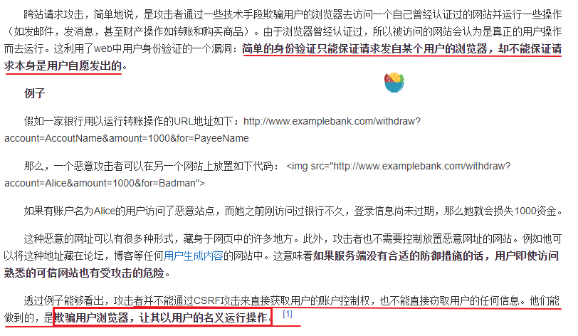

### 2) 实现原理

> 自从 4.0 开始，默认情况下会启动 CSRF 保护，但默认只会针对 PATCH、POST、PUT、DELETE 方法进行防护

1. 在认证成功后会生成一个 **csrfToken** 保存在 Session / Cookie 中	
2. 当用户再次访问数据请求资源时，需要携带对应的 **csrfToken** 才可以

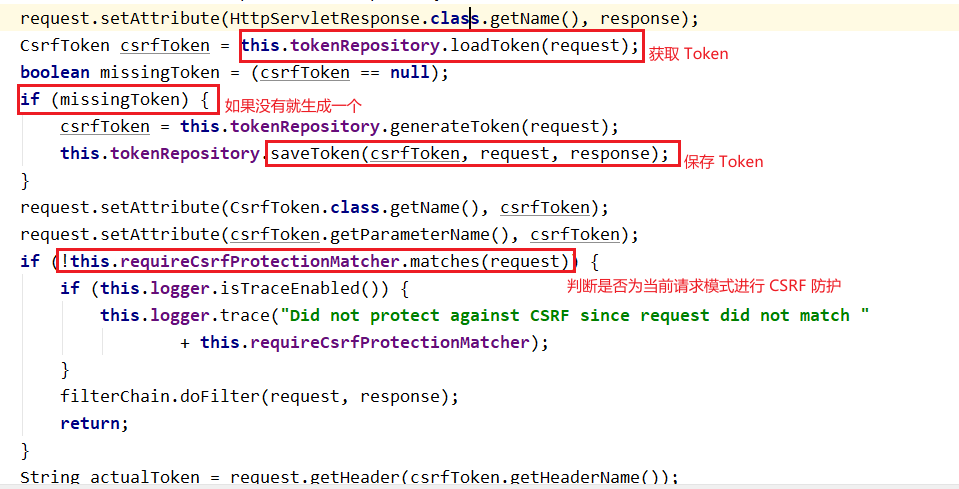

### 3) 整合 Thymeleaf 实现

1. 导入对应的依赖

   ```xml
   <dependency>
       <groupId>org.springframework.boot</groupId>
       <artifactId>spring-boot-starter-thymeleaf</artifactId>
   </dependency>
   ```

2. 将配置类中的 `http.csrf().disable()` 删除

3. 创建一个 HTML 页面，在进行 POST/PUT/DELETE/PATCH 请求，带上以下数据

   ```html
   <input type="hidden" th:value="${_csrf.token}" th:name="${_csrf.parameterName}">
   ```

   该数据 (CsrfToken) 会在 SpringBoot 进行视图模板解析时自动附上

   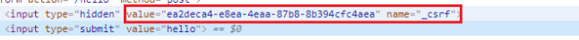

4. 如果不带上该数据，就会报错

   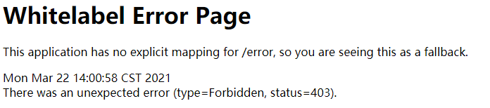

# 第三章 微服务授权方案

> Spring Cloud Gateway + Spring Cloud Alibaba Nacos + Spring Security Oauth2 + Jwt +  + SSO

## 3.1 OAuth2.0

### 简介

OAuth 2.0是用于授权的行业标准协议。OAuth 2.0为简化客户端开发提供了特定的授权流，包括Web应用、桌面应用、移动端应用等。

### 术语

- Resource owner(资源拥有者)：拥有该资源的最终用户，具有访问资源的账号密码
- Resource server(资源服务器)：拥有收保护的资源的服务器，请求中需要由正确的访问令牌才可以访问
- Client(客户端)：访问资源的客户端，会使用访问令牌获取资源服务器的资源
- Authorization server(认证服务器)：用于认证用户的服务器，如果认证通过，就发放资源服务器的令牌

### 授权模式

1. Authorization Code(授权码模式)：客户端先将用户导向认证服务器，登录后获取授权码，再进行授权，最后根据授权码获取访问令牌

   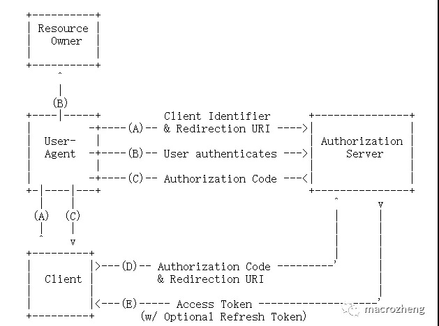

   1. 客户端将用户导向认证服务器；
   2. 用户在认证服务器进行登录并授权；
   3. 认证服务器返回授权码给客户端；
   4. 客户端通过授权码和跳转地址向认证服务器获取访问令牌；
   5. 认证服务器发放访问令牌（有需要带上刷新令牌）。

2. Resource Owner Password Credentials(密码模式)：和授权码模式相比，取消了获取授权码的过程，直接获取访问令牌；

   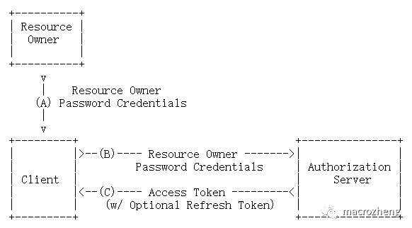

   1. 客户端从用户获取用户名和密码；
   2. 客户端通过用户的用户名和密码访问认证服务器；
   3. 认证服务器返回访问令牌（有需要带上刷新令牌）。

3. Implicit(简化模式)：和授权码模式相比，取消了授权码的过程，直接获取访问令牌

4. Client Credentials(客户端模式)：直接通过客户端认证从认证服务器中获取访问令牌

## 3.2 Jwt

主要解决的是用户与服务端集群的通信 -  [解析 JWT 字符串](https://jwt.io/)

### **结构说明**

> Header.(头部).Payload.(负载).Signature(签名)

**Header：**Header 部分是一个 JSON 对象，描述 JWT 的元数据，例如 - 

```json
{
    "alg": "HS256",
    "typ": "JWT"
}
```

`alg`属性表示签名的算法（algorithm），默认是 HMAC SHA256（写成 HS256）；

`typ`属性表示这个令牌（token）的类型（type），JWT 令牌统一写为`JWT`。

最后，将上面的 JSON 对象使用 Base64URL 算法（详见后文）转成字符串。


**Payload：**也是一个 JSON 对象，用来存放实际需要传递的数据。JWT 规定了7个官方字段，供选用。

- iss (issuer)：签发人
- exp (expiration time)：过期时间
- sub (subject)：主题
- aud (audience)：受众
- nbf (Not Before)：生效时间
- iat (Issued At)：签发时间
- jti (JWT ID)：编号

注意，这个部分 JWT 默认是不加密的，任何人都可以读到，所以不要把秘密信息放在这个部分。

这个 JSON 对象也要使用 Base64URL 算法转成字符串。


**Signature：** Signature 部分是对前两部分的签名，防止数据篡改。

首先，需要指定一个密钥（secret）。这个密钥只有服务器才知道，不能泄露给用户。然后，使用 Header 里面指定的签名算法（默认是 HMAC SHA256），按照下面的公式产生签名。

```
HMACSHA256(
  base64UrlEncode(header) + "." +
  base64UrlEncode(payload),secret)
```

算出签名以后，把 Header、Payload、Signature 三个部分拼成一个字符串，每个部分之间用"点"（`.`）分隔，就可以返回给用户。

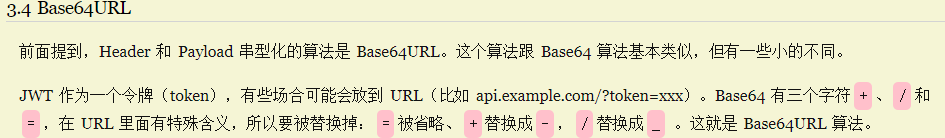


### **特点**

1. JWT 默认是不加密，但也是可以加密的。生成原始 Token 以后，可以用密钥再加密一次。
2. JWT 不加密的情况下，不能将秘密数据写入 JWT。
3. JWT 不仅可以用于认证，也可以用于交换信息。有效使用 JWT，可以降低服务器查询数据库的次数。
4. JWT 的最大缺点是，由于服务器不保存 session 状态，因此无法在使用过程中废止某个 token，或者更改 token 的权限。也就是说，一旦 JWT 签发了，在到期之前就会始终有效，除非服务器部署额外的逻辑。
5. JWT 本身包含了认证信息，一旦泄露，任何人都可以获得该令牌的所有权限。为了减少盗用，JWT 的有效期应该设置得比较短。对于一些比较重要的权限，使用时应该再次对用户进行认证。
6. 为了减少盗用，JWT 不应该使用 HTTP 协议明码传输，要使用 HTTPS 协议传输。

### 和传统的 Cookie/Session 对比

Cookie/Session 需要在服务器 Session 存用户信息，然后拿客户端 Cookie 存储的 SessionId 获取用户信息，这个过程需要消耗服务器的内存和对客户端的要求比较严格（需支持 Cookie），而 JWT 最大的特性在于就是**无状态、去中心化**，所以 JWT 更适用分布式的场景，不需要在多台服务器做会话同步这种消耗服务器性能的操作。

### 和 Oauth2 的关系

- OAuth2是一种认证授权的**协议规范**。
- JWT是基于token的安全认证协议的实现。

**OAuth2的认证服务器签发的token可以使用JWT实现**

## 3.3 加密技术

### **对称加密**

将明文分成N个组,然后使用密钥对各个组进行加密,形成各自的密文,最后把所有的分组密文进行合并,形成最终的密文.

优劣势: 算法公开, 计算量小, 加密速度快, 加密效率高.双方都使用同样的密钥,安全性得不到保证. 如 AES

### **非对称加密**

同时生成两把密钥,私钥和公钥,私钥隐秘保存,公钥可以下发给信任客户端, **私钥加密:持有私钥或公钥才可以解密.公钥加密:持有私钥才可**

优劣势: 安全,难以破解;算法比较耗时. 如 RSA

### **不可逆加密** 

加密过程中不需要使用密钥,输入明文后由系统直接经过加密算法处理成密文,这种加密后的数据是无法被解密的,无法根据密文推算出明文. 如 MD5，SHA

### **结合 RSA**

> **RSA加密算法**是一种[非对称加密算法](https://zh.wikipedia.org/wiki/非对称加密演算法)

首先利用 RSA 生成公钥和私钥，私钥保存在鉴权中心，公钥保存在 Gateway 和各个微服务中

用户请求登录 -> 权中心校验，通过后**用私钥对JWT进行签名加密**，返回jwt给用户 -> 用户携带jwt访问 ->

Gateway 直接通过**公钥解密 JWT**，进行验证，验证通过则放行 -> 请求到达微服务，微服务直接用**公钥解析JWT**，获取用户信息，==无需访问认证服务器的鉴权中心==

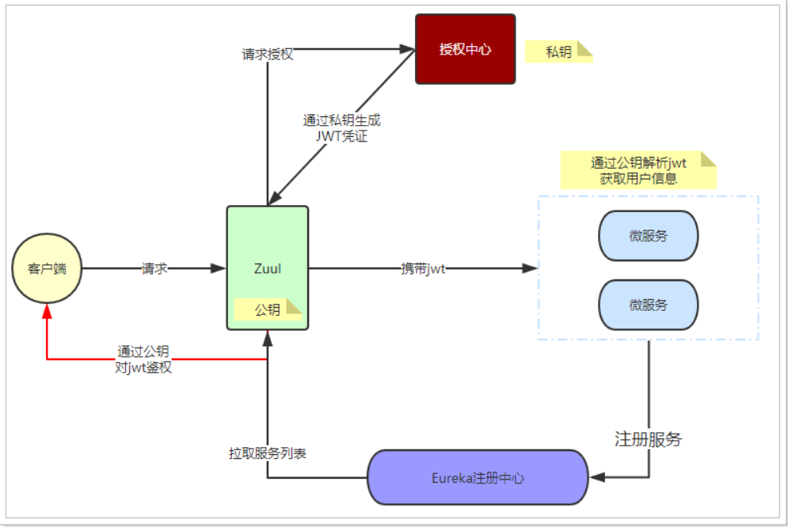

## 3.3 项目搭建

使用技术: SpringBoot + SpringCloud Gateway + SpringSecurity OAuth2 + Jwt + Redis

### 模块划分

> 对应 Oauth2 协议中的两个角色(Resource server + Authorization server)

| 模块名称 | 模块              | OAuth2角色 | 服务地址       |
| :------- | :---------------- | :--------- | :------------- |
| 认证中心 | cloud-auth-server | 认证服务器 | localhost:8000 |
| 网关     | cloud-gateway     | 资源服务器 | localhost:9999 |
| 资源服务 | cloud-api         | 资源服务器 | localhost:8100 |

用户不能直接访问网关(资源服务器)，必须先去认证服务器认证，通过后得到一个 token，只有带着 token 访问网关才可以访问，且 token 是有时间限制的，到时间了就无效

其中网关为什么能作为“**资源服务器**”呢？ 网关是作为各个微服务（会员服务、商品服务、订单服务等）统一入口，也就是这些资源服务的统一门面，在这里可以对**Token验签、Token有效期判断、Token携带角色权限判断**。

### 生成 RSA 证书

> Java自带的工具 keytool 可以用来生成密钥证书，如果使用 RSA 算法，那这份证书里就会包含有私钥和公钥
>
> 参考博客：https://blog.csdn.net/long_chuanren/article/details/82881683

1. 进入到 jdk 的 bin 目录中，执行以下命令

   ```
   keytool -genkey -alias jwt -keyalg RSA -keystore D:/OtherInstall/Gateway_Resources/jwt.jks 
   ```

   alias: 证书别名，keyalg：密钥算法，keystore：证书文件保存的位置和名称([windows 报错](https://blog.csdn.net/hssdw25172008/article/details/8499423))

2. 输入证书库的密码，但不是生成的证书的密码，这是两个不同的密码。

   并不建议吧证书库的密码和证书的密码设置成一样的

   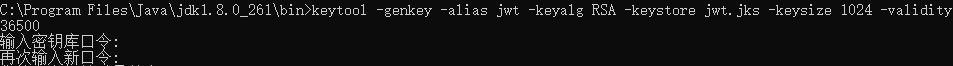

3. 之后，keytool 会要求你输入自己的姓名、所在单位/公司/组织的名称、所在城市的名称、所在地区的名称、和2位的国家编码，照着它的引导步骤做就可以了。如果所有信息都输入正确的话，记得在最后输入y，并回车

   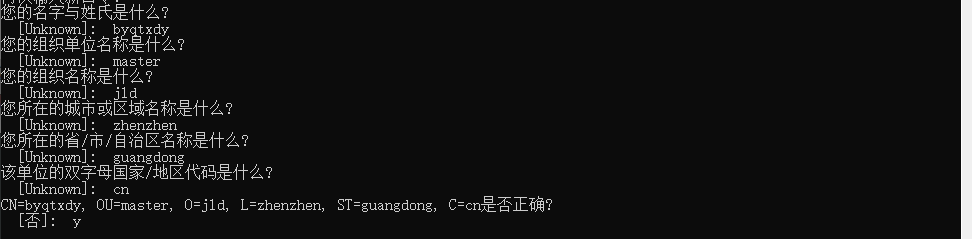

4. 最后再输入一个**证书的密码**即可

   

5. 将生成的证书库复制保存在通用模块的 `/resource` 下即可


### 父工程依赖

```xml
<parent>
    <groupId>org.springframework.boot</groupId>
    <artifactId>spring-boot-starter-parent</artifactId>
    <version>2.3.11.RELEASE</version>
    <relativePath/> <!-- lookup parent from repository -->
</parent>

<!-- 配置同一的版本号 -->
<properties>
    <project.build.sourceEncoding>UTF-8</project.build.sourceEncoding>
    <maven.compiler.source>1.8</maven.compiler.source>
    <maven.compiler.target>1.8</maven.compiler.target>
    <junit.version>4.12</junit.version>
    <log4j.version>1.2.17</log4j.version>
    <lombok.version>1.16.18</lombok.version>
    <mysql.version>8.0.17</mysql.version>
    <druid.version>1.1.16</druid.version>
    <mybatis-plus.spring.boot.version>3.4.2</mybatis-plus.spring.boot.version>
</properties>

<!--
使用 dependencyManagement 可以让项目中使用的依赖
锁定版本 + 子模块可以不用带 groupId 和 version
-->
<dependencyManagement>
    <dependencies>
        <dependency>
            <groupId>org.apache.maven.plugins</groupId>
            <artifactId>maven-project-info-reports-plugin</artifactId>
            <version>3.0.0</version>
        </dependency>
        <!-- SpringCloud 使用 SR11 -->
        <dependency>
            <groupId>org.springframework.cloud</groupId>
            <artifactId>spring-cloud-dependencies</artifactId>
            <version>Hoxton.SR9</version>
            <type>pom</type>
            <scope>import</scope>
        </dependency>
        <!-- SpringCloud Alibaba -->
        <dependency>
            <groupId>com.alibaba.cloud</groupId>
            <artifactId>spring-cloud-alibaba-dependencies</artifactId>
            <version>2.2.5.RELEASE</version>
            <type>pom</type>
            <scope>import</scope>
        </dependency>
        <!--log4j-->
        <dependency>
            <groupId>log4j</groupId>
            <artifactId>log4j</artifactId>
            <version>${log4j.version}</version>
        </dependency>
        <!-- lombok -->
        <dependency>
            <groupId>org.projectlombok</groupId>
            <artifactId>lombok</artifactId>
            <version>${lombok.version}</version>
            <optional>true</optional>
        </dependency>
        <dependency>
            <groupId>org.apache.commons</groupId>
            <artifactId>commons-lang3</artifactId>
            <version>3.11</version>
        </dependency>
        <dependency>
            <groupId>org.apache.commons</groupId>
            <artifactId>commons-collections4</artifactId>
            <version>4.2</version>
        </dependency>
        <dependency>
            <groupId>com.alibaba</groupId>
            <artifactId>fastjson</artifactId>
            <version>1.2.71</version>
        </dependency>
        <dependency>
            <groupId>cn.hutool</groupId>
            <artifactId>hutool-all</artifactId>
            <version>5.6.7</version>
        </dependency>
    </dependencies>
</dependencyManagement>
```

### 搭建公用模块

1. 创建新模块 Module `cloud-comm`

2. 导入需要的依赖

   ```xml
   <dependencies>
       <!--授权-->
       <dependency>
           <groupId>org.springframework.cloud</groupId>
           <artifactId>spring-cloud-starter-security</artifactId>
       </dependency>
       <dependency>
           <groupId>org.springframework.cloud</groupId>
           <artifactId>spring-cloud-starter-oauth2</artifactId>
       </dependency>
       <dependency>
           <groupId>org.projectlombok</groupId>
           <artifactId>lombok</artifactId>
       </dependency>
       <dependency>
           <groupId>org.apache.commons</groupId>
           <artifactId>commons-lang3</artifactId>
       </dependency>
   
       <dependency>
           <groupId>org.apache.commons</groupId>
           <artifactId>commons-collections4</artifactId>
       </dependency>
       <dependency>
           <groupId>com.alibaba</groupId>
           <artifactId>fastjson</artifactId>
       </dependency>
       <dependency>
           <groupId>cn.hutool</groupId>
           <artifactId>hutool-all</artifactId>
       </dependency>
       <dependency>
           <groupId>com.nimbusds</groupId>
           <artifactId>nimbus-jose-jwt</artifactId>
           <version>8.16</version>
       </dependency>
       <dependency>
           <groupId>org.springframework.boot</groupId>
           <artifactId>spring-boot-starter-data-redis</artifactId>
       </dependency>
   </dependencies>
   ```

3. 定义统一的 api 返回接口

   ```java
   @Data
   @Builder(toBuilder = true)
   @NoArgsConstructor
   @AllArgsConstructor
   public class CommonResult<T> {
   
       private Integer code;
       private String message;
       private T data;
   
   }
   ```

4. 定义项目中会使用到的常量

   ```java
   /**
    * @program: cloud-authorization
    * @description: 认证过程中使用的常量类
    * @author: EMTKnight
    * @create: 2021-06-10
    **/
   
   public class AuthConstant {
   
       public static final String AUTHORITY_PREFIX = "ROLE_";
       public static final String AUTHORITY_CLAIM_NAME = "authorities";
   
   }
   ```

   ```java
   /**
    * @program: cloud-authorization
    * @description: 定义消息常量
    * @author: EMTKnight
    * @create: 2021-06-10
    **/
   public class MessageConstant {
   
       public static final String SPLIT_COMMA = ",";
       public static final String LOGIN_SUCCESS = "登录成功!";
       public static final String USERNAME_PASSWORD_ERROR = "用户名或密码错误!";
       public static final String CREDENTIALS_EXPIRED = "该账户的登录凭证已过期，请重新登录!";
       public static final String ACCOUNT_DISABLED = "该账户已被禁用，请联系管理员!";
       public static final String ACCOUNT_LOCKED = "该账号已被锁定，请联系管理员!";
       public static final String ACCOUNT_EXPIRED = "该账号已过期，请联系管理员!";
       public static final String PERMISSION_DENIED = "没有访问权限，请联系管理员!";
       public static final String NOT_FOUND_CLIENT = "未找到客户端!";
   
   }
   ```

   ```java
   /**
    * @program: cloud-authorization
    * @description: 配置 Redis 使用的常量
    * @author: EMTKnight
    * @create: 2021-06-10
    **/
   
   public class RedisConstant {
   
       public static final String RESOURCE_ROLES_MAP = "AUTH:RESOURCE_ROLES_MAP";
   
   }
   ```

5. 配置 Redis 和 Jwt 存储令牌

   ```java
   @EnableCaching
   @Configuration
   public class RedisConfig extends CachingConfigurerSupport {
   
       @Bean
       public RedisTemplate<String, Object> redisTemplate(RedisConnectionFactory factory) {
           RedisTemplate<String, Object> redisTemplate = new RedisTemplate<>();
           redisTemplate.setConnectionFactory(factory);
           StringRedisSerializer stringRedisSerializer = new StringRedisSerializer();
           redisTemplate.setKeySerializer(stringRedisSerializer);
           redisTemplate.setHashKeySerializer(stringRedisSerializer);
           Jackson2JsonRedisSerializer<?> jackson2JsonRedisSerializer = new Jackson2JsonRedisSerializer<>(Object.class);
           redisTemplate.setValueSerializer(jackson2JsonRedisSerializer);
           redisTemplate.setHashValueSerializer(jackson2JsonRedisSerializer);
           redisTemplate.afterPropertiesSet();
           return redisTemplate;
       }
   
       @Bean
       public CacheManager cacheManager(RedisConnectionFactory factory) {
           RedisSerializer<String> redisSerializer = new StringRedisSerializer();
           Jackson2JsonRedisSerializer jackson2JsonRedisSerializer = new Jackson2JsonRedisSerializer(Object.class);
           //解决查询缓存转换异常的问题
           ObjectMapper om = new ObjectMapper();
           om.setVisibility(PropertyAccessor.ALL, JsonAutoDetect.Visibility.ANY);
           om.enableDefaultTyping(ObjectMapper.DefaultTyping.NON_FINAL);
           jackson2JsonRedisSerializer.setObjectMapper(om);
           // 配置序列化（解决乱码的问题）,过期时间600秒
           RedisCacheConfiguration config = RedisCacheConfiguration.defaultCacheConfig()
               .entryTtl(Duration.ofSeconds(600))
               .serializeKeysWith(RedisSerializationContext.SerializationPair.fromSerializer(redisSerializer))
               .serializeValuesWith(RedisSerializationContext.SerializationPair.fromSerializer(jackson2JsonRedisSerializer))
               .disableCachingNullValues();
           RedisCacheManager cacheManager = RedisCacheManager.builder(factory)
               .cacheDefaults(config)
               .build();
           return cacheManager;
       }
   }
   ```

   ```java
   @Configuration
   public class JwtTokenStoreConfig {
   
       @Primary
       @Bean
       public TokenStore jwtTokenStore() {
           return new JwtTokenStore(jwtAccessTokenConverter());
       }
   
       @Bean
       public JwtAccessTokenConverter jwtAccessTokenConverter() {
           JwtAccessTokenConverter converter = new JwtAccessTokenConverter();
           converter.setSigningKey("byqtxdy");
           converter.setKeyPair(keyPair());
           return converter;
       }
   
       /**
        * 配置 jwt 密钥对
        * @return
        */
       @Bean
       public KeyPair keyPair() {
           // 从classpath下的证书中获取证书库中的数据
           KeyStoreKeyFactory keyStoreKeyFactory = new KeyStoreKeyFactory(new ClassPathResource("jwt.jks"), "123456".toCharArray());
           // 获取指定的密钥对
           return keyStoreKeyFactory.getKeyPair("jwt", "123456".toCharArray());
       }
   
   }
   
   ```

6. 配置鉴权管理者

   ```java
   @Component
   public class AuthorizationManager implements ReactiveAuthorizationManager<AuthorizationContext> {
   
       @Autowired
       private RedisTemplate redisTemplate;
   
       @Override
       public Mono<AuthorizationDecision> check(Mono<Authentication> mono, AuthorizationContext authorizationContext) {
           AntPathMatcher antPathMatcher = new AntPathMatcher();
           // 从 redis 中获取当前资源的可访问角色列表
           URI uri = authorizationContext.getExchange().getRequest().getURI();
           Map<String, List<String>> resourceMap = redisTemplate.opsForHash().entries(RedisConstant.RESOURCE_ROLES_MAP);
           List<String> authorities = new ArrayList<>();
           for (Object key : resourceMap.keySet()) {
               if (antPathMatcher.match((String) key, uri.getPath())) {
                   authorities = resourceMap.get(key);
                   break;
               }
           }
           // 映射为 ROLE_+权限名 的格式
           authorities = authorities.stream().map(i -> i = AuthConstant.AUTHORITY_PREFIX + i).collect(Collectors.toList());
           return mono
               // 过滤留下当前用户已经认证的权限
               .filter(Authentication::isAuthenticated)
               // flux 响应式相关的操作，不太懂
               .flatMapIterable(Authentication::getAuthorities)
               .map(GrantedAuthority::getAuthority)
               // 如果用户的权限中有当前访问资源所需角色就返回一个 true，否则返回 false
               .any(authorities::contains)
               // 映射成对应的 AuthorizationDecision(授权决定)
               .map(AuthorizationDecision::new)
               // 如果上述结果为空就创建一个模块为 false 的授权决定
               .defaultIfEmpty(new AuthorizationDecision(false));
       }
   
   }
   ```

### 搭建认证服务器

> 主要功能：接受用户的登录请求,通过用户中心的接口进行校验,通过后生成 jwt,使用私钥生成jwt并返回

1. 创建新模块 Module `cloud-auth-server`

2. 导入需要的依赖

   ```xml
   <dependencies>
       <dependency>
           <groupId>com.alibaba.cloud</groupId>
           <artifactId>spring-cloud-starter-alibaba-nacos-discovery</artifactId>
       </dependency>
   
       <dependency>
           <groupId>org.springframework.cloud</groupId>
           <artifactId>spring-cloud-starter-oauth2</artifactId>
       </dependency>
       <dependency>
           <groupId>org.springframework.cloud</groupId>
           <artifactId>spring-cloud-starter-security</artifactId>
       </dependency>
   
       <dependency>
           <groupId>org.springframework.boot</groupId>
           <artifactId>spring-boot-starter-web</artifactId>
       </dependency>
   
       <dependency>
           <groupId>pers.dreamer07.springcloud</groupId>
           <artifactId>cloud-comm</artifactId>
           <version>${project.version}</version>
       </dependency>
   
   </dependencies>
   ```
   
3. 创建 `application.properties` 文件

   ```properties
   server.port=8000
   spring.application.name=cloud-auth-server
   
   spring.cloud.nacos.discovery.server-addr=localhost:8848
   
   spring.redis.host=192.168.127.137
   #Redis服务器连接端口
   spring.redis.port=6379
   #Redis数据库索引（默认为0）
   spring.redis.database= 0
   #连接超时时间（毫秒）
   spring.redis.timeout=1800000
   ```
   
4. 创建已认证的客户端实体和业务信息实体

   授权客户端信息实体

   ```java
   /**
    * @program: cloud-authorization
    * @description: 存储客户端信息的实体类
    * @author: EMTKnight
    * @create: 2021-06-10
    **/
   @Data
   @EqualsAndHashCode(callSuper = false)
   @AllArgsConstructor
   @Builder(toBuilder = true)
   public class Client{
   
       /**
        * 客户端 id
        */
       private String clientId;
   
       /**
        * 资源 id
        */
       private String resourceIds;
   
       /**
        * 是否必须携带 client-secret
        */
       private Boolean secretRequire;
   
       /**
        * client-secret
        */
       private String clientSecret;
   
       /**
        * 是否必须携带范围
        */
       private Boolean scopeRequire;
   
       /**
        * 范围
        */
       private String scope;
   
       /**
        * 支持的认证类型
        */
       private String authorizedGrantTypes;
   
       /**
        * 用于授权成功后跳转
        */
       private String webServerRedirectUri;
   
   
       private String authorities;
   
       /**
        * 令牌的过期时间
        */
       private Integer accessTokenValidity;
   
       /**
        * 刷新令牌的过期时间
        */
       private Integer refreshTokenValidity;
   }
   ```

   授权客户端业务实体

   ```java
   @Data
   @NoArgsConstructor
   @AllArgsConstructor
   public class ClientPrincipal implements ClientDetails {
   
       private Client client;
   
       @Override
       public String getClientId() {
           return client.getClientId();
       }
   
       @Override
       public Set<String> getResourceIds() {
           return new HashSet<>(Arrays.asList(client.getResourceIds().split(MessageConstant.SPLIT_COMMA)));
       }
   
       @Override
       public boolean isSecretRequired() {
           return client.getSecretRequire();
       }
   
       @Override
       public String getClientSecret() {
           return client.getClientSecret();
       }
   
       @Override
       public boolean isScoped() {
           return client.getScopeRequire();
       }
   
       @Override
       public Set<String> getScope() {
           return new HashSet<>(Arrays.asList(client.getScope().split(MessageConstant.SPLIT_COMMA)));
       }
   
       @Override
       public Set<String> getAuthorizedGrantTypes() {
           return new HashSet<>(Arrays.asList(client.getAuthorizedGrantTypes().split(MessageConstant.SPLIT_COMMA)));
       }
   
       @Override
       public Set<String> getRegisteredRedirectUri() {
           return new HashSet<>(Arrays.asList(client.getWebServerRedirectUri().split(MessageConstant.SPLIT_COMMA)));
       }
   
       @Override
       public Collection<GrantedAuthority> getAuthorities() {
           Collection<GrantedAuthority> collection = new ArrayList<>();
           Arrays.asList(client.getAuthorities().split(MessageConstant.SPLIT_COMMA)).forEach(
               auth -> collection.add((GrantedAuthority) () -> auth)
           );
           return collection;
       }
   
       @Override
       public Integer getAccessTokenValiditySeconds() {
           return client.getAccessTokenValidity();
       }
   
       @Override
       public Integer getRefreshTokenValiditySeconds() {
           return client.getRefreshTokenValidity();
       }
   
       @Override
       public boolean isAutoApprove(String scope) {
           return false;
       }
   
       @Override
       public Map<String, Object> getAdditionalInformation() {
           return null;
       }
   }
   ```

5. 实现 **ClientDetailsService** 接口用户加载授权客户端的信息

   ```java
   @Service
   public class ClientDetailsServiceImpl implements ClientDetailsService {
   
       private List<Client> clientList;
   
       @Autowired
       private PasswordEncoder passwordEncoder;
   
       @PostConstruct
       public void initData() {
           // 加密密码
           String clientSecret = passwordEncoder.encode("123456");
           clientList = new ArrayList<>();
           // 1、密码模式和授权码模式
           clientList.add(Client.builder()
                          .clientId("client-app") // 客户端 id
                          .resourceIds("oauth2-resource")
                          .secretRequire(true)
                          .clientSecret(clientSecret) // 客户端 secret
                          .scopeRequire(true)
                          .scope("all") // 申请访问
                          
                          .authorizedGrantTypes("authorization_code,password,refresh_token") // 配置授权模式
                          .webServerRedirectUri("http://www.baidu.com")
                          .authorities("master")
                          .accessTokenValidity(3600) // 令牌有效期
                          .refreshTokenValidity(86400).build()); // 刷新令牌的有效期
       }
   
       @Override
       public ClientDetails loadClientByClientId(String clientId) throws ClientRegistrationException {
           List<Client> findClientList = this.clientList.stream()
               .filter(client -> client.getClientId().equals(clientId))
               .collect(Collectors.toList());
           if (CollUtil.isEmpty(findClientList)) {
               throw new ResponseStatusException(HttpStatus.NOT_FOUND, MessageConstant.NOT_FOUND_CLIENT);
           }
           return new ClientPrincipal(findClientList.get(0));
       }
   
   }
   ```

6. 实现 **UserDetailsService** 接口用于校验和加载用户信息

   ```java
   @Service
   public class UserDetailsServiceImpl implements UserDetailsService {
   
       private List<User> userList;
   
       @Autowired
       private PasswordEncoder passwordEncoder;
   
       /**
        * 作用在方法上，在当前 bean 实例创建且属性赋值完成后，调用该方法
        * 模拟加载数据库数据
        */
       @PostConstruct
       public void initData(){
           // 加密密码
           String encodePass = passwordEncoder.encode("123456");
           // 添加用户信息数据
           userList = new ArrayList<>(3);
           userList.add(new User("张三", encodePass, AuthorityUtils.commaSeparatedStringToAuthorityList("admin")));
           userList.add(new User("李四", encodePass, AuthorityUtils.commaSeparatedStringToAuthorityList("client")));
           userList.add(new User("王五", encodePass, AuthorityUtils.commaSeparatedStringToAuthorityList("client")));
       }
   
       /**
        * 加载用户信息
        * @param s
        * @return
        * @throws UsernameNotFoundException
        */
       @Override
       public UserDetails loadUserByUsername(String s) throws UsernameNotFoundException {
           // 获取指定的用户信息
           List<User> findUserList = userList.stream()
               .filter(user -> user.getUsername().equals(s))
               .collect(Collectors.toList());
           if (CollectionUtils.isEmpty(findUserList)){
               throw new UsernameNotFoundException(MessageConstant.USERNAME_PASSWORD_ERROR);
           }
           return findUserList.get(0);
       }
   }
   ```

7. 配置**认证服务器**

   ```java
   @AllArgsConstructor
   @Configuration
   @EnableAuthorizationServer
   public class AuthorizationServerConfig extends AuthorizationServerConfigurerAdapter {
   
       private UserDetailsServiceImpl userDetailsService;
       private ClientDetailsServiceImpl clientDetailsService;
   
       private AuthenticationManager authenticationManager;
   
       private TokenStore jwtTokenStore;
   
       private JwtAccessTokenConverter jwtAccessTokenConverter;
   
   
       @Override
       public void configure(ClientDetailsServiceConfigurer clients) throws Exception {
           clients.withClientDetails(clientDetailsService);
       }
   
       @Override
       public void configure(AuthorizationServerEndpointsConfigurer endpoints) {
           endpoints.authenticationManager(authenticationManager)
               .userDetailsService(userDetailsService)
               // 配置 JWT 存储令牌
               .tokenStore(jwtTokenStore)
               .accessTokenConverter(jwtAccessTokenConverter);
       }
   
       /**
        * 允许客户端进行表单身份验证
        * @param security
        */
       @Override
       public void configure(AuthorizationServerSecurityConfigurer security) {
           security.allowFormAuthenticationForClients();
       }
   }
   ```
   
8. 需要对外暴露一个获取 RSA 公钥的接口

   ```java
   @RestController
   public class KeyPairController {
   
       @Autowired
       private KeyPair keyPair;
   
       @GetMapping("/rsa/publicKey")
       public Map<String, Object> getKey() {
           RSAPublicKey publicKey = (RSAPublicKey) keyPair.getPublic();
           RSAKey key = new RSAKey.Builder(publicKey).build();
           return new JWKSet(key).toJSONObject();
       }
   
   }
   ```

9. 配置 SpringSecurity 安全访问的路径

   ```java
   @Configuration
   @EnableWebSecurity
   public class SecurityConfig extends WebSecurityConfigurerAdapter {
   
       @Bean
       public PasswordEncoder passwordEncoder(){
           return new BCryptPasswordEncoder();
       }
   
       /**
        *  如果不配置 SpringBoot 会自动配置一个 AuthenticationManager,覆盖掉内存中的用户
        */
       @Bean
       @Override
       protected AuthenticationManager authenticationManager() throws Exception {
           return super.authenticationManager();
       }
   
       /**
        * 配置访问路径
        * @param http
        * @throws Exception
        */
       @Override
       protected void configure(HttpSecurity http) throws Exception {
           http
               .csrf().disable() // 关闭 csrf
               .authorizeRequests() // 配置直接访问的路径
               .antMatchers("/oauth/**", "/login/**", "/logout/**", "/rsa/publicKey").permitAll()
               .anyRequest().authenticated()
               .and().formLogin().permitAll(); // 开启表单登录
       }
   
   
   }
   ```
   
10. 创建一个业务类，可以在认证服务器启动后，将资源与对应的角色匹配关系保存到 redis 中

    ```java
    @Service
    public class ResourceServerImpl {
    
        @Autowired
        private RedisTemplate<String, Object> redisTemplate;
    
    
        /**
         * 将资源与对应的角色匹配关系保存到 redis 中
         */
        @PostConstruct
        public void initData() {
            Map<String, List<String>> resourceRolesMap = new TreeMap<>();
            resourceRolesMap.put("/services/**", ImmutableList.of("client"));
            resourceRolesMap.put("/api/**", ImmutableList.of("admin"));
            redisTemplate.opsForHash().putAll(RedisConstant.RESOURCE_ROLES_MAP, resourceRolesMap);
        }
    
    }
    ```

### 搭建网关

1. 新建模块 Module `cloud-gateway`

2. 修改 POM，导入需要的依赖

   ```xml
   <dependencies>
       <dependency>
           <groupId>com.alibaba.cloud</groupId>
           <artifactId>spring-cloud-starter-alibaba-nacos-discovery</artifactId>
       </dependency>
       <dependency>
           <groupId>org.springframework.boot</groupId>
           <artifactId>spring-boot-starter-webflux</artifactId>
       </dependency>
       <dependency>
           <groupId>org.springframework.cloud</groupId>
           <artifactId>spring-cloud-starter-gateway</artifactId>
       </dependency>
       <dependency>
           <groupId>org.springframework.security</groupId>
           <artifactId>spring-security-config</artifactId>
       </dependency>
       <dependency>
           <groupId>pers.dreamer07.springcloud</groupId>
           <artifactId>cloud-comm</artifactId>
           <version>${project.version}</version>
       </dependency>
       <dependency>
           <groupId>org.springframework.security</groupId>
           <artifactId>spring-security-oauth2-resource-server</artifactId>
       </dependency>
       <dependency>
           <groupId>org.springframework.security</groupId>
           <artifactId>spring-security-oauth2-jose</artifactId>
       </dependency>
   </dependencies>
   ```

3. 创建 `application.yml` 文件，配置网关转发的相关信息

   ```yaml
   server:
     port: 9999
   spring:
     application:
       name: cloud-gateway
     cloud:
       nacos:
         server-addr: localhost:8848
       gateway:
         discovery:
           locator:
             enabled: true  # 开启从注册中心动态创建路由的功能
             lower-case-service-id: true # 使用小写服务名，默认是大写
         routes:
           # 配置认证服务器
           - id: cloud-oauth-server
             uri: lb://cloud-auth-server
             predicates:
               - Path=/oauth/token,/oauth/authorize,/login
             filters:
               - PreserveHostHeader
           - id: cloud-auth-server
             uri: lb://cloud-auth-server
             predicates:
               - Path=/auth/**
             filters:
               - StripPrefix=1
           # 配置 api 接口服务
           - id: cloud-api
             uri: lb://cloud-api
             # StripPrefix 表示转发与请求的路径去掉一个前缀: /api/client/xxx(客户端请求) -> /client/xxx(实际转发请求)
             predicates:
               - Path=/api/**
             filters:
               - StripPrefix=1
           - id: cloud-services
             uri: lb://cloud-services
             predicates:
               - Path=/services/**
             filters:
               - StripPrefix=1
     # 配置 jwt 公钥访问地址
     security:
       oauth2:
         resourceserver:
           jwt:
             jwk-set-uri: 'http://localhost:8000/rsa/publicKey'
             
     redis:
       database: 0
       port: 6379
       host: 192.168.127.137
       password:
   secure:
     ignore:
       urls: # 配置白名单路径
         - "/oauth/token"
         - "/oauth/authorize"
         - "/login"
   ```

4. 创建**白名单**配置类

   ```java
   @Data
   @Component
   @ConfigurationProperties(prefix = "secure.ignore")
   public class IgnoreUrlsConfig {
   
       private List<String> urls;
   
   }
   ```

5. 配置白名单过滤器

   ```java
   /**
    * @program: cloud-authorization
    * @description: 配置白名单过滤器，保证访问白名单的接口时直接放行
    * @author: EMTKnight
    * @create: 2021-06-10
    **/
   @Component
   public class IgnoreUrlsRemoveJwtFilter implements WebFilter {
   
       @Autowired
       private IgnoreUrlsConfig ignoreUrlsConfig;
   
       @Override
       public Mono<Void> filter(ServerWebExchange exchange, WebFilterChain chain) {
           // 获取请求路径
           URI uri = exchange.getRequest().getURI();
           // 创建一个 Ant 风格的匹配器
           AntPathMatcher antPathMatcher = new AntPathMatcher();
           // 遍历白名单
           List<String> urls = ignoreUrlsConfig.getUrls();
           for (String ignoreUrl : urls) {
               // 匹配请求路径和白名单路径
               if (antPathMatcher.match(ignoreUrl, uri.getPath())) {
                   // 如果匹配成功就删除对应的请求头
                   ServerHttpRequest request = exchange.getRequest().mutate().header("Authorization", "").build();
                   // 重新构建 request 和 exchange
                   ServerWebExchange buildExchange = exchange.mutate().request(request).build();
                   return chain.filter(buildExchange);
               }
           }
   
           return chain.filter(exchange);
       }
   
   }
   
   ```

6. 配置**未授权/未认证**的处理类

   ```java
   /**
    * @program: cloud-authorization
    * @description: 处理 token 过期/错误/未认证
    * @author: EMTKnight
    * @create: 2021-06-10
    **/
   @Component
   public class RestAuthenticationEntryPoint implements ServerAuthenticationEntryPoint {
   
       @Override
       public Mono<Void> commence(ServerWebExchange exchange, AuthenticationException e) {
           ServerHttpResponse response = exchange.getResponse();
           response.setStatusCode(HttpStatus.UNAUTHORIZED);
           response.getHeaders().add(HttpHeaders.CONTENT_TYPE, MediaType.APPLICATION_JSON_VALUE);
           String body = JSONObject.toJSONString(CommonResult.builder()
                   .message(e.getMessage()).code(HttpStatus.UNAUTHORIZED.value()).build()
           );
           DataBuffer buffer = response.bufferFactory().wrap(body.getBytes(StandardCharsets.UTF_8));
           return response.writeWith(Mono.just(buffer));
       }
   
   }
   ```

   ```java
   @Component
   public class RestfulAccessDeniedPoint implements ServerAccessDeniedHandler {
   
       @Override
       public Mono<Void> handle(ServerWebExchange exchange, AccessDeniedException exception) {
           ServerHttpResponse response = exchange.getResponse();
           response.setStatusCode(HttpStatus.FORBIDDEN);
           response.getHeaders().add(HttpHeaders.CONTENT_TYPE, MediaType.APPLICATION_JSON_VALUE);
           String body = JSONObject.toJSONString(CommonResult.builder()
                   .message(exception.getMessage()).code(HttpStatus.FORBIDDEN.value()).build()
           );
           DataBuffer buffer = response.bufferFactory().wrap(body.getBytes(StandardCharsets.UTF_8));
           return response.writeWith(Mono.just(buffer));
       }
   
   }
   ```
   
7. 配置全局拦截器：使 jwt 可以跟随请求转发到其他服务以便获取用户信息

   ```java
   @Component
   @Slf4j
   public class AuthGlobalFilter implements GlobalFilter, Ordered {
   
       @Override
       public Mono<Void> filter(ServerWebExchange exchange, GatewayFilterChain chain) {
           String token = exchange.getRequest().getHeaders().getFirst("Authorization");
           if (StrUtil.isEmpty(token)) {
               return chain.filter(exchange);
           }
           try {
               log.info(token);
               // 从 token 中解析 payload 部分并设置到 Header 中去
               String realToken = token.replace("Bearer ", "");
               JWSObject jwsObject = JWSObject.parse(realToken);
               String userStr = jwsObject.getPayload().toString();
               ServerHttpRequest request = exchange.getRequest().mutate().header("payloadInfo", userStr).build();
               exchange = exchange.mutate().request(request).build();
           } catch (ParseException e) {
               e.printStackTrace();
           }
           return chain.filter(exchange);
       }
   
       @Override
       public int getOrder() {
           return 0;
       }
   
   }
   ```

8. 配置资源服务器

   ```java
   /**
    * @program: cloud-authorization
    * @description: 网关服务进行安全配置
    * @author: EMTKnight
    * @create: 2021-06-10
    **/
   @AllArgsConstructor
   @Configuration
   @EnableWebFluxSecurity
   @Slf4j
   public class ResourceServerConfig {
   
       private IgnoreUrlsConfig ignoreUrlsConfig;
   
       private RestAuthenticationEntryPoint restAuthenticationEntryPoint;
   
       private RestfulAccessDeniedPoint restfulAccessDeniedPoint;
   
       private IgnoreUrlsRemoveJwtFilter ignoreUrlsRemoveJwtFilter;
   
       private AuthorizationManager authorizationManager;
   
       /**
        * 配置 Security Web 拦截器链
        * @param http
        * @return
        */
       @Bean
       public SecurityWebFilterChain springSecurityFilterChain(ServerHttpSecurity http){
           http.oauth2ResourceServer().jwt().jwtAuthenticationConverter(jwtAuthenticationConverter());
           // 定义 JWT 请求头过期或签名错误的处理
           http.oauth2ResourceServer().authenticationEntryPoint(restAuthenticationEntryPoint);
           // 针对白名单路径，直接移除JWT请求头
           http.addFilterBefore(ignoreUrlsRemoveJwtFilter, SecurityWebFiltersOrder.AUTHENTICATION);
           http.authorizeExchange()
               // 配置白名单放行
               .pathMatchers(ArrayUtil.toArray(ignoreUrlsConfig.getUrls(), String.class)).permitAll()
               // 配置鉴权管理器
               .anyExchange().access(authorizationManager)
               // 配置异常的拦截器链
               .and().exceptionHandling()
               .accessDeniedHandler(restfulAccessDeniedPoint)  // 处理未授权
               .authenticationEntryPoint(restAuthenticationEntryPoint)  // 处理未认证
               .and().csrf().disable();
           return http.build();
       }
   
       /**
        * 配置使用 jwt 进行认证的转换器
        * @return
        */
       @Bean
       public Converter<Jwt, ? extends Mono<? extends AbstractAuthenticationToken>> jwtAuthenticationConverter() {
           JwtGrantedAuthoritiesConverter jwtGrantedAuthoritiesConverter = new JwtGrantedAuthoritiesConverter();
           jwtGrantedAuthoritiesConverter.setAuthorityPrefix(AuthConstant.AUTHORITY_PREFIX);
           jwtGrantedAuthoritiesConverter.setAuthoritiesClaimName(AuthConstant.AUTHORITY_CLAIM_NAME);
           JwtAuthenticationConverter jwtAuthenticationConverter = new JwtAuthenticationConverter();
           jwtAuthenticationConverter.setJwtGrantedAuthoritiesConverter(jwtGrantedAuthoritiesConverter);
           return new ReactiveJwtAuthenticationConverterAdapter(jwtAuthenticationConverter);
       }
   }
   ```

9. 启动网关，访问 http://localhost:9999/oauth/authorize?response_type=code&client_id=client-app&client_secret=123456&redirect_uri=http://www.baidu.com&scope=all&state=normal

   请求参数说明：

   - response_type - Oauth2 的授权模式
   - client_id & client_secre t- 由认证服务器配置，表示可信任
   - redirect_uri - 得到 code 后跳转的页面
   - scope - 申请的权限类型

10. 登录后进行授权，可以查看地址栏得到对应的 code

    

11. 访问 http://localhost:9999/oauth/token 编写对应的请求头后即可得到令牌

    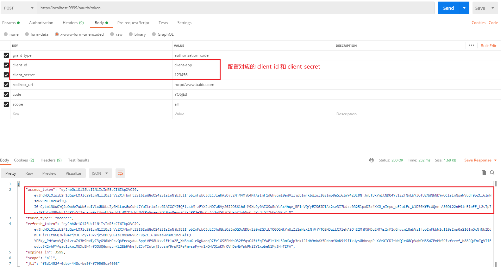

12. 将令牌的信息拿去解析可以得到对应的数据

    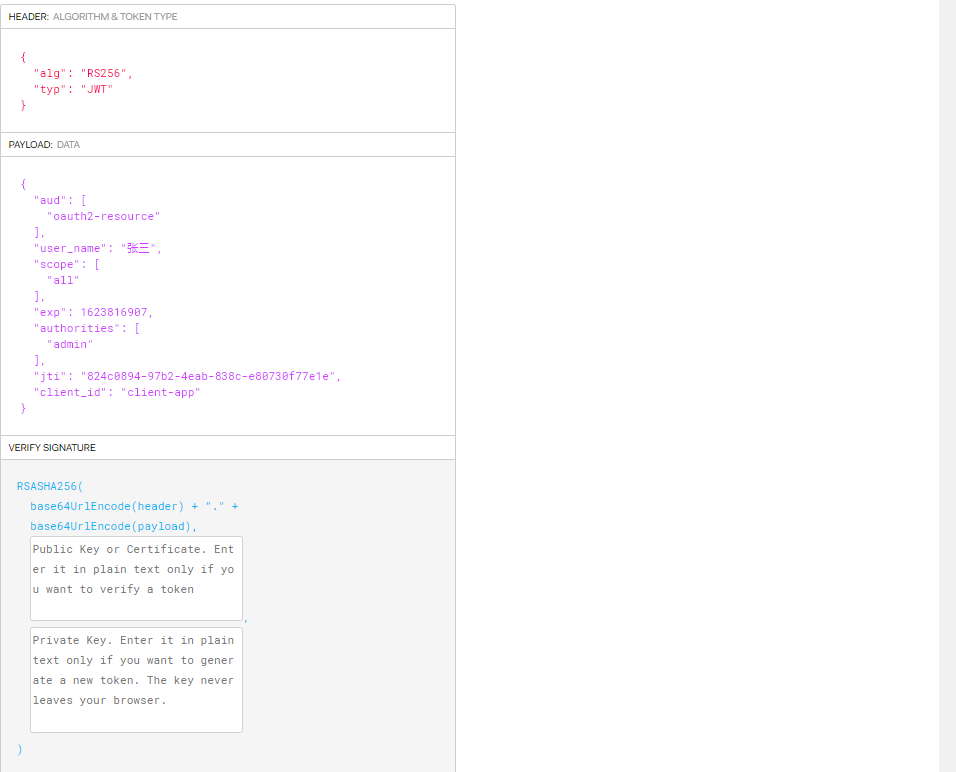

13. 测试刷新令牌

    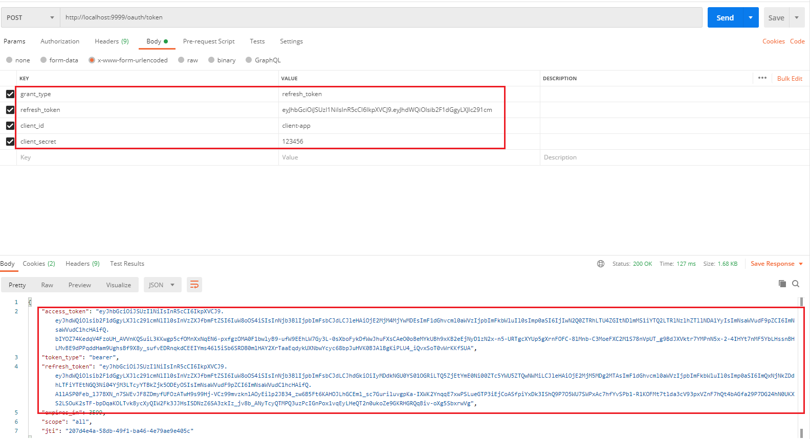

### 搭建资源服务器

1. 导入对应的依赖

   ```xml
   <dependencies>
       <dependency>
           <groupId>org.springframework.boot</groupId>
           <artifactId>spring-boot-starter-web</artifactId>
       </dependency>
       <!-- spring boot 相关依赖 -->
       <dependency>
           <groupId>org.springframework.boot</groupId>
           <artifactId>spring-boot-starter-actuator</artifactId>
       </dependency>
       <dependency>
           <groupId>com.alibaba.cloud</groupId>
           <artifactId>spring-cloud-starter-alibaba-nacos-discovery</artifactId>
       </dependency>
       <!--授权-->
       <dependency>
           <groupId>pers.dreamer07.springcloud</groupId>
           <artifactId>cloud-comm</artifactId>
           <version>${project.version}</version>
       </dependency>
   </dependencies>
   ```

2. 编写一个配置文件

   ```yaml
   server:
     port: 8100
   spring:
     application:
       name: cloud-api
     cloud:
       nacos:
         server-addr: localhost:8848
     redis:
       host: 192.168.127.137
       port: 6379
       database: 0
       timeout: 1800000
   ```

3. 资源服务器配置

   ```java
   @Configuration
   @EnableResourceServer
   // 开启权限注解
   @EnableGlobalMethodSecurity(prePostEnabled = true)
   public class ResourceServerConfig extends ResourceServerConfigurerAdapter {
   
       @Autowired
       private TokenStore jwtTokenStore;
   
       /**
        * 资源ID
        */
       private static final String RESOURCE_ID = "oauth2-resource";
   
       /**
        *  资源配置
        */
       @Override
       public void configure(ResourceServerSecurityConfigurer resources) {
           resources.resourceId(RESOURCE_ID)
               .tokenStore(jwtTokenStore)
               .stateless(true);
       }
   
       /**
        * 请求配置
        */
       @Override
       public void configure(HttpSecurity http) throws Exception {
           http.authorizeRequests()
               .antMatchers("/**").access("#oauth2.hasScope('all')")
               .and().csrf().disable()
               .sessionManagement().sessionCreationPolicy(SessionCreationPolicy.STATELESS);
       }
   
   
   }
   ```

4. 编写业务接口

   ```java
   @RestController
   @RequestMapping("/admin")
   public class AdminController {
   
       @GetMapping("/getCurrentAdminInfo")
       @PreAuthorize("hasAnyAuthority('admin')")
       public Object getCurrentAdminInfo(Authentication authentication){
           return authentication;
       }
   
   }
   ```

5. 启动后，访问 http://localhost:9999/api/admin/getCurrentAdminInfo

   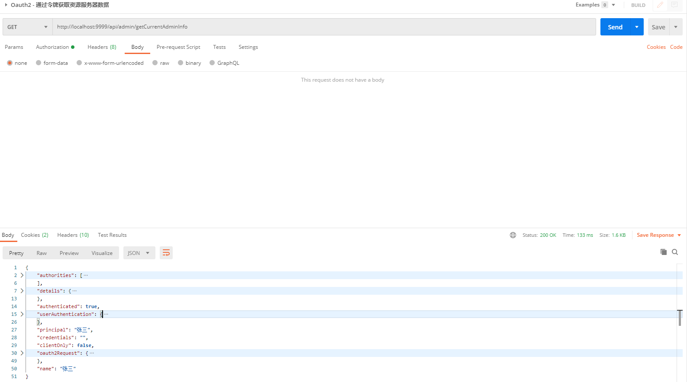


