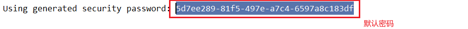
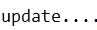
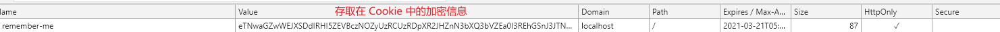

# 第一章 简介

## 1.1 概要

Spring Security 基于 Spring 框架，提供了一套 Web 应用安全性的完整解决方案

Web 应用的安全性包括 **用户认证(Authentication)**  和 **用户授权(Authorization)** 两个部分，这两个部分也是 Spring Security 的重要核心功能

- 用户认证( Authentication )

  

- 用户授权( Authorization )

  

## 1.2 同款产品对比

SpringSecurity 特点

1. 和 Spring 无缝整合
2. 全面的权限控制
3. 专门为 Web 开发而设计
   - 旧版本不能脱离 Web 环境使用
   - 新版本中对整个框架进行了**分层抽取**，分成了核心模块和 Web 模块，单独引入核心模块就可以脱离 Web 环境
4. 重量级(缺点)

Shiro 的特点

1. 轻量级。针对性能有更高要求的互联网应用有更好表现
2. 通用性
   - 好处：不局限于 Web 环境，可以脱离 Web 环境使用
   - 坏处：在 Web 环境下一些特定的需求需要手动编写代码定制


## 1.3 Hello World

1. 创建对应的 SpringBoot 工程

2. 导入对应的依赖

   ```xml
   <dependency>
       <groupId>org.springframework.boot</groupId>
       <artifactId>spring-boot-starter-security</artifactId>
   </dependency>
   ```

3. 编写 Controller，启动服务器并访问

   

4. Spring Security 提供默认的用户名(user)和密码(查看控制台打印)

   

5. 登录后查看响应

## 1.4 Spring Security 基本原理

> Spring Security 本质就是一个 **过滤器链**

### 1) 过滤器链

**FilterSecurityInterceptor**：方法级别的权限过滤器，基本位于过滤链的最底层

```dart
// FilterInvocation 实例 - 一个包装类而已
doiFilter() -> invoke(new FilterInvocation(request, response, chain));
```


**ExceptionTranslationFilter**：异常过滤器，用来处理认证授权过程中出现的异常	


**UsernamePasswordAuthenticationFilter**: 对 /login 的 POST 请求做拦截，校验表单中的用户名和密码

```java
private void doFilter(HttpServletRequest request, HttpServletResponse response, FilterChain chain)
    throws IOException, ServletException {
    if (!requiresAuthentication(request, response)) {
        chain.doFilter(request, response);
        return;
    }
    try {
        // 获取用户登录信息
        Authentication authenticationResult = attemptAuthentication(request, response);
        if (authenticationResult == null) {
            // return immediately as subclass has indicated that it hasn't completed
            return;
        }
        this.sessionStrategy.onAuthentication(authenticationResult, request, response);
        // Authentication success
        if (this.continueChainBeforeSuccessfulAuthentication) {
            chain.doFilter(request, response);
        }
        // 认证成功的方法
        successfulAuthentication(request, response, chain, authenticationResult);
    }
    catch (InternalAuthenticationServiceException failed) {
        // 认证失败的方法
        this.logger.error("An internal error occurred while trying to authenticate the user.", failed);
        unsuccessfulAuthentication(request, response, failed);
    }
    catch (AuthenticationException ex) {
        // Authentication failed
        unsuccessfulAuthentication(request, response, ex);
    }
}
```

### 2) 过滤器加载过程 

1. 使用 **DelegatingFilterProxy.doFilter()** 配置过滤器

   

2.  获取保存在 Web 子容器中的 **FilterChainProxy(过滤器链代理对象)** 组件

   

3. `FilterChainProxy.doFilter()` -> `doFilterInternal()` 获取过滤器链并执行其中的过滤器

   
   

### 3) 两个重要接口

#### 一、UserDetailsService

作用：查询数据库中用户的信息

实现步骤：

1. 创建一个类继承 **UsernamePasswordAuthenticationFilter** 类，重写三个方法(

   `attemptAuthentication(HttpServletRequest request, HttpServletResponse response)` 进行用户名和密码的判断、

   `successfulAuthentication(HttpServletRequest request, HttpServletResponse response, FilterChain chain,Authentication authResult)` - 认证成功、

   `unsuccessfulAuthentication(HttpServletRequest request, HttpServletResponse response,AuthenticationException failed)`  - 认证失败

   )

2. 创建一个类实现 **UserDetailsService** 接口，重写 `loadUserByUsername` 查询数据库用户数据后，返回 User 对象(该对象是 Spring Security 的那个)

#### 二、PasswordEncoder

作用：数据加密接口，用于返回 User 对象中的密码加密

# 第二章 Web 权限控制方案

## 2.1 (认证)设置登录的用户名和密码

### 1) 通过配置文件

```properties
# 配置用户名和密码
spring.security.user.name=Geek
spring.security.user.password=123456
```

### 2) 通过配置类

```java
/**
* 重写 configure(AuthenticationManagerBuilder auth) 创建一个用户
* @param auth
* @throws Exception
*/
@Override
protected void configure(AuthenticationManagerBuilder auth) throws Exception {
    // 通过 BCryptPasswordEncoder 密码加密接口对密码进行加密
    String encode = new BCryptPasswordEncoder().encode("123456");
    // inMemoryAuthentication()：将用户身份信息保存到内存中
    auth.inMemoryAuthentication().withUser("geek").password(encode).roles("admin");
}

/**
* 将数据加密方式对应的实现类作为 Bean 注册到 IOC 容器中
* @return
*/
@Bean
public PasswordEncoder passwordEncoder(){
    return new BCryptPasswordEncoder();
}
```

### 3) 自定义编写实现类

设计一个 Security 配置类，配置使用的 UserDetailsService 组件

```java
@Configuration
public class SecurityConfig extends WebSecurityConfigurerAdapter {

    @Autowired
    private UserDetailsService userDetailsService;

    /**
     * 重写 configure(AuthenticationManagerBuilder auth) 创建一个用户
     * @param auth
     * @throws Exception
     */
    @Override
    protected void configure(AuthenticationManagerBuilder auth) throws Exception {
        auth.userDetailsService(userDetailsService);
    }

}
```

设计一个实现 **UserDetailsService** 接口的实现类，返回用户信息

```java
@Service("userDetailsService")
public class MyUserDetailsService implements UserDetailsService {

    @Autowired
    @Qualifier("passwordEncoder")
    private PasswordEncoder passwordEncoder;

    @Override
    public UserDetails loadUserByUsername(String s) throws UsernameNotFoundException {
        List<GrantedAuthority> grantedAuthorities = AuthorityUtils.commaSeparatedStringToAuthorityList("master");
        return new User("geek", passwordEncoder.encode("123456"), grantedAuthorities);
    }

}
```

## 2.2 自定义登录界面 & 自定义配置请求是否需要认证

1. 进行相关的配置

   ```java
   /**
   * 配置登录页面的请求拦截
   * @param http
   * @throws Exception
   */
   @Override
   protected void configure(HttpSecurity http) throws Exception {
       http.formLogin() // 自定义配置登录表单
           .loginPage("/login.html") // 配置登录页面
           .loginProcessingUrl("/login") // 配置登录页面访问路径，底层由 Spring Security 实现
           .defaultSuccessUrl("/test/index") // 配置登录成功后跳转页面
           .permitAll() // 放行
           .and().authorizeRequests() // 自定义配置拦截请求
           .antMatchers("/", "/login", "/test/hello").permitAll() // 对匹配成功的路径放行(‘permitAll()’)
           .anyRequest().authenticated() // 剩下的任何请求路径都需要认证
           .and().csrf().disable(); // 关闭 csrf 的防护
   }
   ```

2. 添加对应的请求控制器和页面

   ```html
   <!-- action 表单提交的地址必须是刚刚配置的 loginProcessingUrl 的值且提交方式为 POST -->
   <form action="/login" method="post">
       <!-- name 值必须分别为 username & password -->
       <input type="text" name="username"/><br/>
       <input type="text" name="password"/><br/>
       <input type="submit" value="提交"/><br/>
   </form>
   ```

   

3. 测试时如果发现配置的登录界面无法访问时(404), 在 `application.properties` 中添加如下配置

   ```properties
   spring.web.resources.static-locations=classpath:/templates/
   ```

4. 测试

## 2.3  基于角色和权限进行访问控制

> hasAuthority("权限名")：只有具有对应的权限的主体才可以进行相应的操作

1. 添加配置

   ```java
   http.antMatchers("/test/index").hasAuthority("admin") // 在访问对应的资源必须有对应的权限(hasAuthority)
   ```

2. 修改用户权限

   ```java
   @Override
   public UserDetails loadUserByUsername(String s) throws UsernameNotFoundException {
       // 配置对应的权限列表
       List<GrantedAuthority> grantedAuthorities = AuthorityUtils.commaSeparatedStringToAuthorityList("admin");
       return new User("geek", passwordEncoder.encode("123456"), grantedAuthorities);
   }
   ```

3. 测试

   具有相关权限 -> 访问相关

   不具有相关权限 -> 访问失败，放回 403(没有操作权限)

   

> hasAnyAuthority("权限名1"[,"权限名2"...])：只有具有其中任一权限就可以进行相关操作

1. 添加配置

   ```java
   .antMatchers("/test/index").hasAnyAuthority("admin", "master") // 在访问对应的资源时只要有其中一个权限(hasAnyAuthority)
   ```

2. 修改用户权限

   ```java
   @Override
   public UserDetails loadUserByUsername(String s) throws UsernameNotFoundException {
       // 配置对应的权限列表
       List<GrantedAuthority> grantedAuthorities = AuthorityUtils.commaSeparatedStringToAuthorityList("master");
       return new User("geek", passwordEncoder.encode("123456"), grantedAuthorities);
   }
   ```

3. 测试

> hasRole("角色名")：只有具有对应的角色的主体才可以进行相应的操作

1. 添加配置

   ```java
   .hasRole("master") // 访问对应的资源时必须具有对应的角色(hasRole)
   ```

2. 配置用户角色

   ```java
   @Override
   public UserDetails loadUserByUsername(String s) throws UsernameNotFoundException {
       /*
       * 配置对应的权限、角色列表
       *   - 配置用户角色时需要在前面加上 'ROLE_'
       * */
       List<GrantedAuthority> grantedAuthorities = AuthorityUtils.commaSeparatedStringToAuthorityList("ROLE_master");
       return new User("geek", passwordEncoder.encode("123456"), grantedAuthorities);
   }
   ```

   **(底层)添加 ROLE_**

   配置权限

   

   配置角色

   

3. 测试

> hasAnyRole("角色1"[,"角色2"...])：只要具有其中任一角色即可进行相关操作、

1. 添加配置

   ```java
   .hasAnyRole("master", "admin") // 访问对应的资源时只要有其中一个角色即可(hasAnyRole)
   ```

2. 修改用户角色

   ```java
   @Override
   public UserDetails loadUserByUsername(String s) throws UsernameNotFoundException {
       /*
       * 配置对应的权限、角色列表
       *   - 配置用户角色时需要在前面加上 'ROLE_'
       * */
       List<GrantedAuthority> grantedAuthorities = AuthorityUtils.commaSeparatedStringToAuthorityList("ROLE_admin");
       return new User("geek", passwordEncoder.encode("123456"), grantedAuthorities);
   }
   ```

3. 测试

## 2.4 自定义 403 页面

1. 添加配置

   ```java
   @Override
   protected void configure(HttpSecurity http) throws Exception {
       http
           ....
           .exceptionHandling().accessDeniedPage("/unauth.html"); // 配置没有权限时访问的页面
   }
   ```

2. 创建对应的页面

3. 测试

## 2.5 注解使用

### 1) @Secured

> 只有具有任一角色才可以访问对应的方法

1. 在配置类上添加注解 `@EnableGlobalMethodSecurity(securedEnabled = true)`

2. 在对应的控制方法上添加 `@Secured` 注解并指定角色

   ```java
   /*
   * @Secured: 只有主体具有对应 value 中的任一角色才可以访问该请求
   *   - value: String[] 可以配置多个角色，但需要以 ROLE_ 开头
   * */
   @Secured({"ROLE_master", "ROLE_admin"})
   @GetMapping("/secured")
   public String getSecured(){
       return "has role master or admin";
   }
   ```

3. 测试

### 2) @PreAuthorize

> 在调用方法之前判断主体是否具有相应的权限/角色
>
> 

1. 在配置类添加注解 `@EnableGlobalMethodSecurity(prePostEnabled = true) `

2. 在对应的控制器方法上使用

   ```java
   @PreAuthorize("hasAuthority('master')")
   @GetMapping("/secured")
   public String getSecured(){
       return "has role master or admin";
   }
   ```

3. 测试

### 3) @PostAuthorize

> 在对应的控制器方法之后再判断用户是否具有相应的权限/角色

1. 在配置类添加注解 `@EnableGlobalMethodSecurity(prePostEnabled = true) `

2. 在对应的控制器方法上使用

   ```java
   @PostAuthorize("hasAnyAuthority('master')")
   @GetMapping("/secured")
   public String getSecured(){
       System.out.println("update....");
       return "has role master or admin";
   }
   ```

3. 测试，可以发现，无论是否具有该权限，对应请求的控制器方法都会执行

   

### 4) @PreFilter & @PostFilter

> @PreFilter：对方法传入的数据进行过滤
>
> @PostFilter：对方法返回的数据进行过滤

1. 在对应的控制器方法上使用并定义过滤

   ```java
   /* @PreFilter & @PostFilter: 对方法传入的数据进行过滤 & 对方法返回的数据进行过滤
   *   filterTarget: String(@PreFilter 使用) - 当接收多个集合时，可以指定对哪一个集合进行过滤
   *   value: String
   *       - filterObject: 内置对象表示返回(输入)的集合内的对象
   * */
   @GetMapping("/getAll")
   @PostFilter("filterObject.username.equals('巴御前')")
   public List<User> getAll(){
       return new ArrayList<>(
           Arrays.asList(
               new User(11,"阿巴巴", "1123456"),
               new User(17,"巴御前", "20210321")
           )
       );
   }
   ```

2. 测试

   

## 2.6 用户注销

1. 修改配置类

   ```java
   http.logout() // 配置注销设置
       .logoutUrl("/logout") // 设置注销请求地址，默认是 /logout
       .logoutSuccessUrl("/login.html").permitAll(); // 设置注销后的跳转页面
   ```

2. 创建对应的页面

   

3. 测试

## 2.7 基于数据库实现记住我

### 1) 实现原理

1. 当用户进行第一次访问时，Spring Security 会生成一个 Token 保存在 Cookie 中并返回给游览器

2. 同时将该 **Token** 和对应的**用户信息字符串**保存到数据库中

3. 用户进行第二次访问时，判断其是否携带了和数据库中相同的 Token，如果有就将取出用户信息实现自动登录

   如果没有就进行认证


UsernamePasswordAuthenticationFilter.successfulAuthentication() -> this.rememberMeServices.loginSuccess() -> 

创建对应的令牌保存到数据库和 Cookie 中

```java
// 生成 Token
PersistentRememberMeToken persistentToken = new PersistentRememberMeToken(username, generateSeriesData(),
      generateTokenData(), new Date());
try {
   // 保存在数据库中
   this.tokenRepository.createNewToken(persistentToken);
   // 保存到 Cookie 中
   addCookie(persistentToken, request, response);
}
```

保存到数据库中，调用的是 **JdbcTokenRepositoryImpl** 实现类中的方法

```java
@Override
public void createNewToken(PersistentRememberMeToken token) {
   getJdbcTemplate().update(this.insertTokenSql,token.getUsername(),token.getSeries(),token.getTokenValue(), token.getDate());
}
```

### 2) 功能实现

1. [可选可不选] 根据 **JdbcTokenRepositoryImpl** 的 SQL 语句创建对应的数据库

   ```sql
   create table persistent_logins (
       username varchar(64) not null, 
       series varchar(64) primary key, 
       token varchar(64) not null, 
       last_used timestamp not null
   )
   ```

2. 配置数据源和对应的数据库操作组件(JdbcTokenRepositoryImpl)

   ```java
   /**
   * 配置登录页面的请求拦截
   * @param http
   * @throws Exception
   */
   @Override
   protected void configure(HttpSecurity http) throws Exception {
       http
           ...
           .and().rememberMe() // 配置记住我功能
           .tokenRepository(persistentTokenRepository()) // 配置使用的数据库操作对象
           .tokenValiditySeconds(60); // 配置数据库数据过时时长，单位为妙
   }
   /**
   * 创建实现记住我的数据库操作对象
   * @return
   */
   @Bean
   public PersistentTokenRepository persistentTokenRepository(){
       JdbcTokenRepositoryImpl jdbcTokenRepository = new JdbcTokenRepositoryImpl();
       jdbcTokenRepository.setDataSource(dataSource); // 配置数据源
       jdbcTokenRepository.setCreateTableOnStartup(true); // 在启动时自动建表,如果已经存在可以不配置
       return jdbcTokenRepository;
   }
   ```

3. 修改 login.html

   ```html
   <!-- 添加一个 checkbox 用于实现自动登录功能，name 值必须为 remember-me -->
   <input type="checkbox" name="remember-me"/><br/>
   ```

4. 测试

   

   

   

## 2.8 CSRF

### 1) 说明

**跨站请求伪造**

通过缩写为 CSRF / XSRF, 是一种挟制用户在当前已登录的Web[应用程序](https://baike.baidu.com/item/应用程序/5985445)上执行非本意的操作的攻击方法。跟[跨网站脚本](https://baike.baidu.com/item/跨网站脚本/23316003)（XSS）相比，**XSS** 利用的是用户对指定网站的信任，CSRF 利用的是[网站](https://baike.baidu.com/item/网站/155722)对用户[网页浏览器](https://baike.baidu.com/item/网页浏览器/8309940)的信任。


### 2) 实现原理

> 自从 4.0 开始，默认情况下会启动 CSRF 保护，但默认只会针对 PATCH、POST、PUT、DELETE 方法进行防护

1. 在认证成功后会生成一个 **csrfToken** 保存在 Session / Cookie 中	
2. 当用户再次访问数据请求资源时，需要携带对应的 **csrfToken** 才可以


### 3) 整合 Thymeleaf 实现

1. 导入对应的依赖

   ```xml
   <dependency>
       <groupId>org.springframework.boot</groupId>
       <artifactId>spring-boot-starter-thymeleaf</artifactId>
   </dependency>
   ```

2. 将配置类中的 `http.csrf().disable()` 删除

3. 创建一个 HTML 页面，在进行 POST/PUT/DELETE/PATCH 请求，带上以下数据

   ```html
   <input type="hidden" th:value="${_csrf.token}" th:name="${_csrf.parameterName}">
   ```

   该数据 (CsrfToken) 会在 SpringBoot 进行视图模板解析时自动附上

   

4. 如果不带上该数据，就会报错

   


